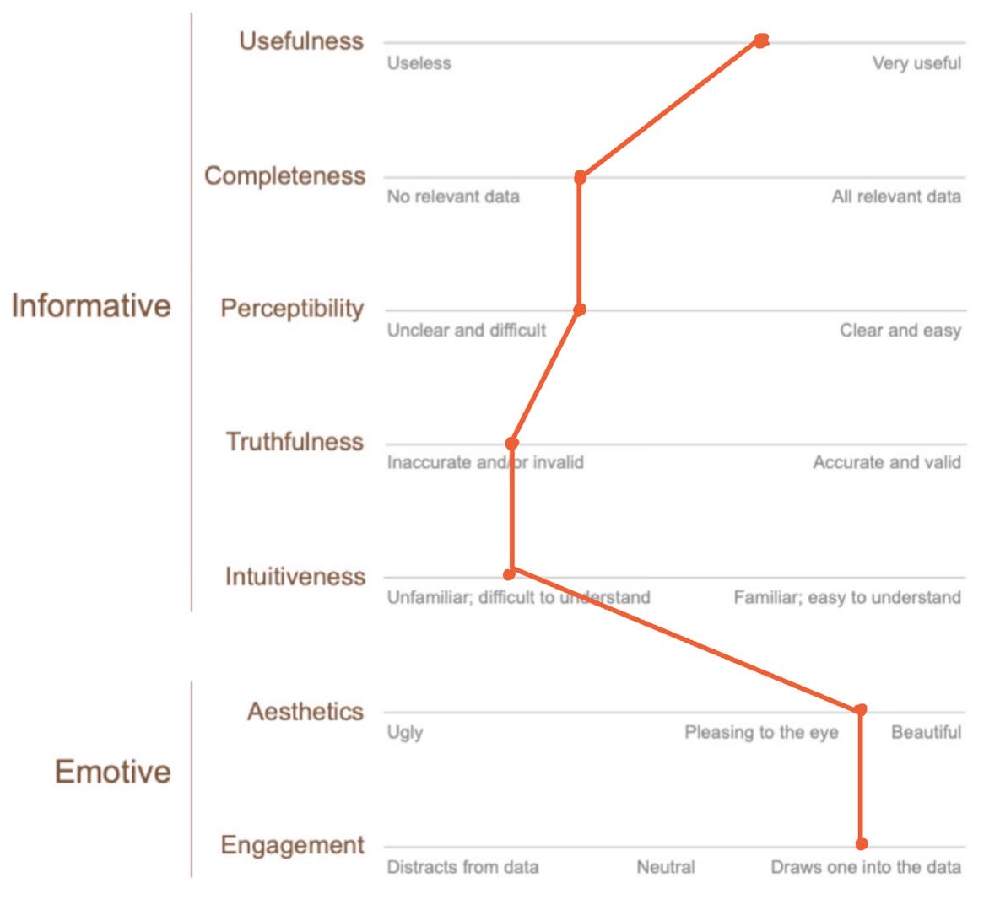

**How american people commute to work (2008)**

 

[Data Source](https://www.shareable.net/where-do-americans-share-transportation/)

Critique 📝
---
Critique methods used: Stephen Few's [Data Visualization Effectiveness Profile](http://www.perceptualedge.com/articles/visual_business_intelligence/data_visualization_effectiveness_profile.pdf)

 

This data visualization attracts me at first sight because of the cozy color pattern and big capitalized city name abbreviation. However, when I investigate it, it’s not intuitive to figure out what this chart is trying to tell the audience. It takes some efforts to then understand title, legends, subtitle and combine all of these to get the idea of this data visualization.

**What stands out 😀**:   

1.	Engagement: Big and striking city name letters: this is what attracts me and invites me to learn more about this chart. It successfully caught my eye at first sight.
2.	Esthetics: 
1>	Good color patterns: the colors chosen contrast well with each other but do not fight with each other, which contributes to the esthetics of this chart.
2>	Nice alignment of items: the alignment is well designed to make this data visualization look clean and neat including each city’s letter and the legends.

**What doesn’t work well 🧐**:  

1.	Perceptibility: 
1>	Font size of title is small compared with subtitle and the visualization letters, which may influence audience’s eye travel (take time to notice the title instead of at first sight)
2>	Font size of legends is small: the font size of legends is similar to that of the data source which makes it difficult to read what each color represents. Alignment of main title and subtitle looks busy.
2.	Intuitiveness: Too many colors in each big city letter make it not intuitive to figure out what this chart means and what each color represents.
3.	Completeness & Truthfulness: lack of figures shown making it hard to compare the difference among different cities. The chart looks beautiful in city letters, but such a representation also loses a certain level of truth. For example, for percent of people who drive, that of LA is actually twice as much as that of SF, while it’s not obvious in this chart.

**Primary audience 🪑**:  

I believe the audience for this chart may be some staff from the Transportation department of the US government or states government, some researchers who study the Transportation change in the US, and some citizens of the US, especially in cities shown in the chart

Usefulness:
Personally, for staff in the government or researchers from relative fields, a chart like this may not be effective. Staff from governments need a much more exact understanding of the commuting situations of different cities instead of a rough feeling like LA has definitely more people driving to work than NYC. Figures should be added, and chart types should be changed to help compare, for example, a grilled bar chart.

For citizens who are interested in commuting ways of different cities in the US, then this chart may be just fine in the perspective of effectiveness because the chart can catch people’s eyes and still give a general sense of which city has more percent of which commuting way.

**Recommendations 🙌🏻**:  

1.	Change this letter chart into grilled bar chart with same size and Y axis scale. In this way, it will be easier to compare the difference among different cities.
2.	Change the font size of the main title and legends to make it more obvious and easier to read. Also, change the alignment of subtitle for it to be under the main title.
3.	Choose a different color pattern where different categories can contrast each other better.
4.	Add data labels to each value to make it even easier to compare.
5.	Change the title to a more informative one: Commute to work in US: Drive? Public trans? Walk? 

**Reflection of critique methods 🤔**:  

With regard to the critique itself, this method is actually a successful method since it takes into consideration not only from the chart perspective, but also from the audience perspective.

However, compared with the method we used in Good Charts book, I feel that it will be better to just list out what I personally think work well or not well since critique itself is very subjective. Especially for the esthetic perspective used in the new method, giving a grade for this part may not seem reasonable since different people have different opinions towards beauty.

Another part mission from this new chart is the recommendation part. With different perspective, we only critique what we think good or bad and it ends. But the purpose of critique is not to give critique, it’s also about a discussion of what can be done differently to serve different audience or purpose.

So if I will add to this new method a part, it will be recommendations for this chart like what has been mentioned above.
