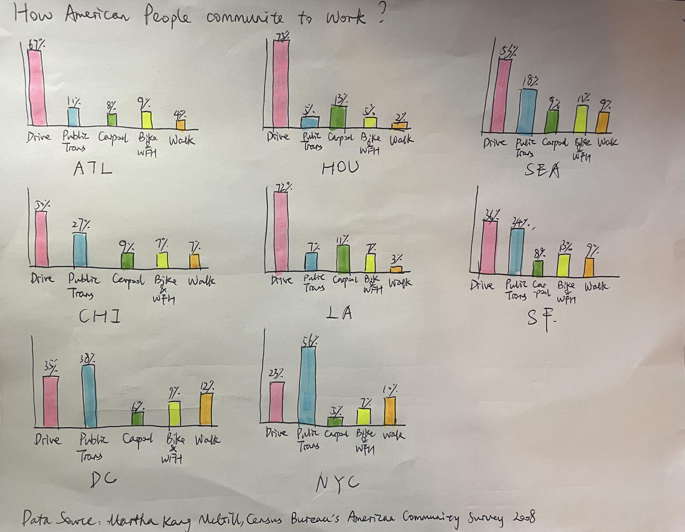

**How american people commute to work (2008)**

 

[Data Source](https://www.shareable.net/where-do-americans-share-transportation/)

Critique 📝
---
Critique methods used: Stephen Few's [Data Visualization Effectiveness Profile](http://www.perceptualedge.com/articles/visual_business_intelligence/data_visualization_effectiveness_profile.pdf)

 

This data visualization attracts me at first sight because of the cozy color pattern and big capitalized city name abbreviation. However, when I investigate it, it’s not intuitive to figure out what this chart is trying to tell the audience. It takes some efforts to then understand title, legends, subtitle and combine all of these to get the idea of this data visualization.

**What stands out 😀**:   

1.	Engagement: Big and striking city name letters: this is what attracts me and invites me to learn more about this chart. It successfully caught my eye at first sight.
2.	Esthetics: 
1>	Good color patterns: the colors chosen contrast well with each other but do not fight with each other, which contributes to the esthetics of this chart.  
2>	Nice alignment of items: the alignment is well designed to make this data visualization look clean and neat including each city’s letter and the legends.

**What doesn’t work well 🧐**:  

1.	Perceptibility: 
1>	Font size of title is small compared with subtitle and the visualization letters, which may influence audience’s eye travel (take time to notice the title instead of at first sight). 
2>	Font size of legends is small: the font size of legends is similar to that of the data source which makes it difficult to read what each color represents. Alignment of main title and subtitle looks busy.
2.	Intuitiveness: Too many colors in each big city letter make it not intuitive to figure out what this chart means and what each color represents.
3.	Completeness & Truthfulness: lack of figures shown making it hard to compare the difference among different cities. The chart looks beautiful in city letters, but such a representation also loses a certain level of truth. For example, for percent of people who drive, that of LA is actually twice as much as that of SF, while it’s not obvious in this chart.

**Primary audience 🪑**:  

I believe the audience for this chart may be some staff from the Transportation department of the US government or states government, some researchers who study the Transportation change in the US, and some citizens of the US, especially in cities shown in the chart

Usefulness:
Personally, for staff in the government or researchers from relative fields, a chart like this may not be effective. Staff from governments need a much more exact understanding of the commuting situations of different cities instead of a rough feeling like LA has definitely more people driving to work than NYC. Figures should be added, and chart types should be changed to help compare, for example, a grilled bar chart.

For citizens who are interested in commuting ways of different cities in the US, then this chart may be just fine in the perspective of effectiveness because the chart can catch people’s eyes and still give a general sense of which city has more percent of which commuting way.

**Recommendations 🙌🏻**:  

1.	Change this letter chart into grilled bar chart with same size and Y axis scale. In this way, it will be easier to compare the difference among different cities.
2.	Change the font size of the main title and legends to make it more obvious and easier to read. Also, change the alignment of subtitle for it to be under the main title.
3.	Choose a different color pattern where different categories can contrast each other better.
4.	Add data labels to each value to make it even easier to compare.
5.	Change the title to a more informative one: Commute to work in US: Drive? Public trans? Walk? 

**Reflection of critique methods 🤔**:  

With regard to the critique itself, this method is actually a successful method since it takes into consideration not only from the chart perspective, but also from the audience perspective.

However, compared with the method we used in Good Charts book, I feel that it will be better to just list out what I personally think work well or not well since critique itself is very subjective. Especially for the esthetic perspective used in the new method, giving a grade for this part may not seem reasonable since different people have different opinions towards beauty.

Another part mission from this new chart is the recommendation part. With different perspective, we only critique what we think good or bad and it ends. But the purpose of critique is not to give critique, it’s also about a discussion of what can be done differently to serve different audience or purpose.

So if I will add to this new method a part, it will be recommendations for this chart like what has been mentioned above.

Sketch Feedbacks✍🏻
---

 

Respondent 1 👩🏻‍💼: project manager, female, mid 30's

**Q1: Can you tell me what you think this is?**  
I think it's about what vehicles or transportation ways American people use to go to work.

**Q2: Can you describe to me what this is telling you?**  
Besides the main idea of showing different commuting ways, this chart also attracts me to look at the highest and lowest bar for each category and think about the reasons behind. For example, this chart tells me DC and NYC's main transportation way is public transportation instead of driving. This is because big cities like DC and NYC are very crowded and highly likely to experience traffic jam. Public transportation, even walking can be better alternative.

**Q3: Is there anything you find surprising or confusing?**  
For the data visualization, nothing surprising or confusing. Bar charts are one of the most common charts we see everyday everywhere. The chart is quite clear to let audience know the main point: American people's commuting ways in several cities.

For the data information, it surprises me when I see that Walking is among the top 3 ways in NYC. Probably it's because of New York's topography， crowdness, high transportation fees.

**Q4: Who do you think is the intended audience for this?**  
Travellers both domestically and internationally. Travellers will be highly interested in the normal and common transportation ways in different cities and will take this information into account to save money or to make the trip convenient when planning their travels. 

**Q5: Is there anything you would change or do differently?**  
1. Typo in the title: communite? or commute! 
2. Confused at first sight about the abbreviation of American cities. Full name of cities shown here will be better.
3. Not easy to compare the commuting ways across cities. It will be better if one more chart which show the comparison grouped by commuting ways can be offered.
4. The X axis of different commuting ways are repeated 8 times and seems busy in small grilled charts. I will use simple and recognizable emoji to represent each way and make a simple legend to explain what each emoji represents.

Respondent 2 👩🏻‍💻: business developer, female, mid 20's

**Q1: Can you tell me what you think this is?**   
Just as the information provided by the title: commuting ways of American people in different cities.

**Q2: Can you describe to me what this is telling you?**   
Different american cities have quite different preferred commuting ways. In large and sparsely populated areas like HOU and ATL, people prefer to drive; in crowded areas like DC and NYC, people prefer public transportation.

**Q3: Is there anything you find surprising or confusing?**  
Because I don't know enough about the various cities in the United States, there is no surprise or confusion in the content of the chart; in the form of the chart, it is recommended to use a stacked bar chart, which will be more convenient for comparison.

**Q4: Who do you think is the intended audience for this?**   
Some government officials, researchers, and local citizens of the United States. 

**Q5: Is there anything you would change or do differently?**   
The purpose of the chart is not clear enough, whether it is to prove a conclusion, to answer a question, or to propose a product. Therefore, for example, if you want to prove that there is a high demand for carpooling in a sparsely populated area, so that the carpooling-related business has a premise background for the development, then you can also add information on the population density of each city, which will make the purpose of the chart more prominent.

Key Takeaway From Feedbacks 🙇🏻‍♀️
---
1. The abbreviation of cities can cause confusion, since abbreviation in 3 letters can have many different representations.
2. The purpose of this chart is not clear. It will be better to target a specific group of audience and design the data visualization accordingly.
3. The representation of different categories are not concise enough since the current commuting ways listed on X axis seems busy.
4. More dimensions or even new data should be offered to make the whole data story more complete.
5. Need to make sure each word is written right.

Final Redesign 🎨
---

<noscript></noscript><object class='tableauViz'  
style='display:none;'><param name='host_url' 
value='https%3A%2F%2Fpublic.tableau.com%2F' /> <param name='embed_code_version' value='3' /> <param name='site_root' value='' /><param name='name' value='CommutingtoworkinUS&#47;Dashboard1' /><param name='tabs' value='no' /><param name='toolbar' value='yes' /><param name='static_image' value='https:&#47;&#47;public.tableau.com&#47;static&#47;images&#47;Co&#47;CommutingtoworkinUS&#47;Dashboard1&#47;1.png' /> <param name='animate_transition' value='yes' /><param name='display_static_image' value='yes' /><param name='display_spinner' 
value='yes' /><param name='display_overlay' 
value='yes' /><param name='display_count' 
value='yes' /><param name='language' 
value='en-US' /><param name='filter' 
value='publish=yes' /></object>
                

  
Tips for interacting with charts:  
1.When selecting a city name in grilled bar chart, corresponding population density will be highlighted; same for selecting a city bubble in bubble chart.  
2.When selecting a commuting way in grilled bar chart, all cities' data with this same commuting way will be highlighted.  

Changes made based on feedbacks:
1. Put full name of each city instead of abbreviation for better perceptibility and intuitiveness.  
2. Changed the title from "How American people commute to work?" to "Most Commonly Used Commuting Transportation in US Cities:" with subtitle "Less populated: Drive; More crowded: Public Trans". This makes the purpose of this chart clearer: for travellers or people who are interested in which transportation is commonly used in each city, this chart tells generally in less populated cities, drive is the top 1 choice for local people while in more crowded cities, public transportation is more widely used.  
3. Shifted from the original loosely aligned grilled column chart to closely aligned grilled bar chart.The commuting ways categories only shows on the very left side, and percent data only shown on the bottom X axis. This avoids repetition and somehow improves the busyness issue.  
4. Commuting categories labels are appended with corresponding emojis and interactions between charts are added to improve engagement and make each category easier and more intuitive to identify.  
5. Population density data and a bubble chart representation is added to justify the main idea of this chart: "generally in less populated cities, drive is the top 1 choice for local people while in more crowded cities, public transportation is more widely used."

Sum up the redesign ✨
---
**1. Main audience**:  
Travellers & people interested in common transportation used in some US cities listed here.  

**2. Main idea**:  
"Generally in less populated cities, drive is the top 1 choice for local people while in more crowded cities, public transportation is more widely used."  

**3. Reason for representation selected**:  
First part of the chart is a grilled bar chart. I chose this since it's easier to compare both in commuting ways perspective and in cities perspective with this chart type.Second part of this chart is a bubble chart. Since there are obvious difference among cities' population density, and the purpose of population density shown is not to give a specific number, but to give a general sense which city is more crowded and which is less populated, bubble chart is nice to serve the objective.  

**4. Difference between the sketch and the redesign**:  
As mentioned in the changes based on feedebacks, the differences between the sketch and the redesign are quite clear.

**Redesign has a more specific audience and story telling purpose with more comfortable alignment, more informative title and subtitle, less busyness, more compelete information, more engagement(I hope so) and no confusion with city names.**

