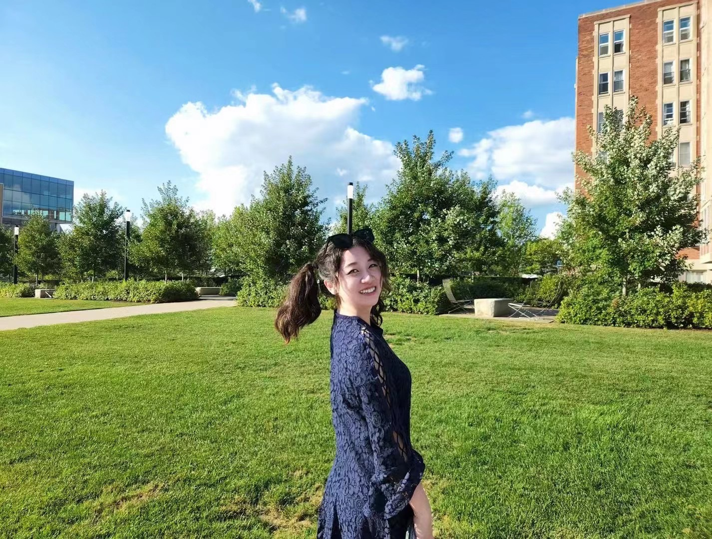

# Telling-stories-with-data 📊
(The link to the webpage: https://caro996.github.io/Telling-stories-with-data/)

## About Me 🦄

 

Hi, this is Caroline.     
  
📍 A current CMU graduate student who loves exploring all kinds of possibilities and uncovering new treasures.  
📍 Pursue a career path of data analyst and business analyst.   
📍 Love Music,making friends and traveling around the world.

## My Favorite Motto 💫
***"Life isn't about to survive the storm, it's about learning to dance in the rain."***\
I came across this sentence in one interview of Taylor Swift.

## What I hope to learn 💡
**Data visualization techniques:**\
How to represent data in each kind of graphs and how to make it user interactive and friendly.\
\
**Data analytics & business analytics skills:**\
Models that can be used to analyze different kinds of data in various senarios.\
\
**Communication skills:**\
How to communicate data stories clearly and attractively in short time and how to let the audience get the main point immediately.\
\
All the other skills needed to become an excellent data analyst / business analyst.
\
\
\
*Welcome To Caroline's Data Story Telling Garden* 🌸 

## Portfolio 📚
