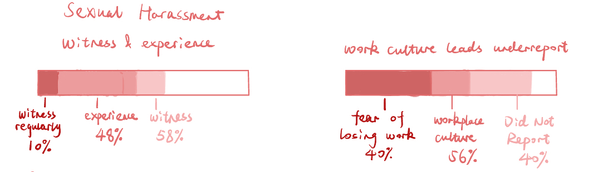
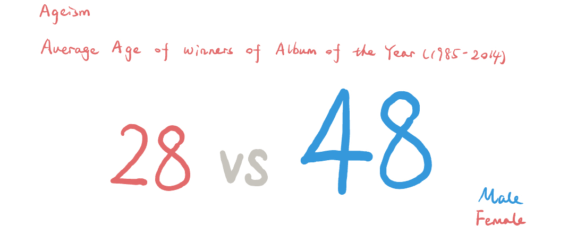

# ***Outline🔖***
**Summary**  
This project looks at women singers' representation in Grammy Musical Award over the years.  
For the past decades of years, women singers have less chance and representation in Grammy.Fortunately, the situation is getting better recently with a noticeable growth in 2019. However, the gender discrimination still exists in a lot of musical awards.  
   
To change this dilemma, to achieve a certain degree of gender equality in music awards and even the entire music industry, we need each of us to contribute our part.  
  
# **Project Structure🧬**
**Topic**:   
Women singers’ representation in Grammy over the years

**Reader perspective**:  
As a music lover or music industry worker, I want to see and work in a music industry where gender equality is not an exception but a rule so that every artist regardless of the gender can get equal opportunities.

**Call to action**:  
I can contribute to a music industry with gender equality by following more the works of female singers, MV directors and producers; and by standing up to support women singers’ rights online when gender discrimination happens.

## **Story Arc**:  
**Emotions of Arc**

 

    
The whole story is divided into 6 big elements or scenarios of smaller story points:    
**Scenario 1**: Women's low representation in Grammy in history.   
**Scenario 2**: Women's low representation in Grammy in recent years.   
**Scenario 3**: Gender Discrimination is not limited to Grammy, but across the whole industry.    
**Scenario 4**: Reasons for Women's low representation in Grammy.   
            Reason 1: Sexual harassment and objectification.    
            Reason 2: Ageism requirements on female artists.    
            Reason 3: Male-dominated jury.     
**Scenario 5**: Why Grammys are so important to artists.     
**Scenario 6**: Call to action to support women music creators and industry workers.    

## ***Scenario 1️⃣***
**First woman wining Grammy in 1959: Ella fitzgerald**

 

     
[Picture Source: GreenLight Rights](https://greenlightrights.com/blog/2018-09-27-ella-fitzgeralds-estate-signs-as-greenlights-newest-icon/)          
   
   
   
**Gender Distribution Of Nominees In The 1st Grammy In 1959**

 

       
[Data Source: Grammy Awards 1959(May)](awardsandshows.com/features/grammy-awards-1959-may-238.html)       

Show the 1st women gaining Grammy: Ella Fitzgerald;   
Followed by the gender distribution of nominees in the 1st Grammy in 1959:  
**woman vs men: 1:6**      
📍 Story Telling Point: women’s low representation at the very beginning since Grammy has existed.  
   
   
   
## ***Scenario 2️⃣***
**Growth of women nominees’ percent share (2013 - 2021) in Grammy**     

 

     
[Data Source: Share of Grammy nominations in the United States from 2013 to 2021, by gender](https://www.statista.com/statistics/801372/gender-grammy-nominees/)    
   
   
   
**Women Representation Percent Comparison 1959 vs Recent 9 years in Grammy**   

 

       
[Data Source1: Share of Grammy nominations in the United States from 2013 to 2021, by gender](https://www.statista.com/statistics/801372/gender-grammy-nominees/)  
[Data Source2: Grammy Awards 1959(May)](awardsandshows.com/features/grammy-awards-1959-may-238.html)       
   
Show the growth of women nominees’ percent share of Grammy from 2013 to 2021;    
Followed by total gender distribution, which is actually similar to that of the 1st Grammy.     
📍 Story Telling Point: women’s low representation after 50 years.    
   
   
   
## ***Scenario 3️⃣***
**CMA(Country Music Association Award) Winners By Gender (2000 - 2019)**     

 

     
[Data Source: Gender Representation of CMA Awards: A Study of Nominees and Winners, 2000-2019](https://songdata.ca/wp-content/uploads/2019/11/SongData_Watson-CMA-NominationHistoryNovember2019.pdf)    
   
   
   
**Women Representation Of 900 Popular Songs(2012-2020) in the US Music Industry**   

 

       
[Data Source:Gender Inequality in the Music Industry (2022) – Statistics and Thoughts](https://www.musicianwave.com/gender-inequality-in-the-music-industry-statistics/)       
   
Show first the time line of 19 years of CMA : **women only won in 5 years out of 19 years**.    
Then show the general music industry women representation chart break down with bar charts.        
📍 Story Telling Point: Gender discrimination is not limited to Grammy, but also the whole music industry.      
   
   
   
## ***Scenario 4️⃣***    
**Reason 1: Sexual Harassment**    
**Sexual Harassment in Music Industry Scared Talents Away(2019)**   
800 female musicians are surveyed on report of sexual harassement

 

     
[Data Source:Report on Sexual Harassment in Music Industry;](https://musiciansunion.org.uk/legal-money/workplace-rights-and-legislation/the-equality-act-and-guidance/sexual-harassment-at-work/report-on-sexual-harassment-in-music-industry)    
📍 Story Telling Point: Sexual harassment is highly prevalent in the music industry and **severely underreported**. Women who want to pursue a career in this industry dare not enter it because the prevalent issues here and some talented women artists just left this industry because of the harassment issues.    
   
**Reason 2: Ageism**   
**Average Age Of Winners Of Album Of The Year(1985-2014)**   

 

       
[Data Source:Here’s the Last 30 Album of the Year Grammy Winners By Age](https://www.billboard.com/music/music-news/grammy-age-album-year-winners-graphic-6465426/)       
📍 Story Telling Point: The music industry tend to have higher requirement on female artists age. Music companies prefer artists who are young. This can also be proved by the average age comparison here: the average age of male winners of Album of the Year in Grammy from 1985 to 2014 is 48 while that of women winners is 28.    
      
   
**Reason 3: Male-dominated jury**   
**Gender Distribution Of Members In Recording Academy in 2019**   

 

       
[Data Source:Recording Academy Welcomes “Nearly 2000 Diverse”New Members](https://www.billboard.com/music/music-news/recording-academy-welcomes-nearly-2000-new-members-1235136676/)             
📍 Story Telling Point: Among the Recording Academy members who are the jury of Grammy Music Awards, in 2019, only 31% of members are female.     
   
   
   
## ***Scenario 5️⃣***
**Why Grammys are so important to artists?** 

 

     
[Data Source: Growth of music sales on the day after the Grammy Awards in 2020, by type](https://www.statista.com/statistics/252744/growth-of-music-sales-following-the-grammay-awards/)    
Grammy awards drive the sales of songs and are one of the best ways to advertise artists’ songs.
What happens to females artists is that they are overwhelmed in a vicious circle:   
1.They do not have money to advertize their songs.    
2.Their songs cannot be heard and noticed.     
3.Less or even no popuarity makes it hard to gain Grammys.      
4.No opportunities to reveal his song at the Grammys.      
5.Grammys are always gained by famous artists: success attracts success, while failure induces failure.      
📍 Story Telling Point: More women songs deserve hearing and noticing through Grammys.          
      
## ***Scenario 6️⃣*** 
**Call to action**   
1.	Get involved with organizations that support women in audio.  
2.	Listen to women-created and women-focused music podcasts.  
3.	Interact on social media.  
   
   
# **Use of Data📊**
Data Sources List:
1. [Picture Source: GreenLight Rights](https://greenlightrights.com/blog/2018-09-27-ella-fitzgeralds-estate-signs-as-greenlights-newest-icon/)   
2. [Data Source: Grammy Awards 1959(May)](awardsandshows.com/features/grammy-awards-1959-may-238.html)    
3. [Data Source: Share of Grammy nominations in the United States from 2013 to 2021, by gender](https://www.statista.com/statistics/801372/gender-grammy-nominees/)       
4. [Data Source: Gender Representation of CMA Awards: A Study of Nominees and Winners, 2000-2019](https://songdata.ca/wp-content/uploads/2019/11/SongData_Watson-CMA-NominationHistoryNovember2019.pdf)    
5. [Data Source:Gender Inequality in the Music Industry (2022) – Statistics and Thoughts](https://www.musicianwave.com/gender-inequality-in-the-music-industry-statistics/)   
6. [Data Source:Report on Sexual Harassment in Music Industry;](https://musiciansunion.org.uk/legal-money/workplace-rights-and-legislation/the-equality-act-and-guidance/sexual-harassment-at-work/report-on-sexual-harassment-in-music-industry)      
7. [Data Source:Here’s the Last 30 Album of the Year Grammy Winners By Age](https://www.billboard.com/music/music-news/grammy-age-album-year-winners-graphic-6465426/)   
8. [Data Source:Recording Academy Welcomes “Nearly 2000 Diverse”New Members](https://www.billboard.com/music/music-news/recording-academy-welcomes-nearly-2000-new-members-1235136676/)    
9. [Data Source: Growth of music sales on the day after the Grammy Awards in 2020, by type](https://www.statista.com/statistics/252744/growth-of-music-sales-following-the-grammay-awards/)    
10. [Idea Source: These Are 3 Of The Biggest Drivers Of Gender Inequality In Music](https://www.forbes.com/sites/andreabossi/2021/03/26/these-are-3-of-the-biggest-reported-drivers-of-gender-inequality-in-music/) 
11. [Idea Source: 10 Ways To Support Women Musicians & Creators Year-Round](https://www.grammy.com/news/10-ways-to-support-women-in-music-year-round) 

Data referenced here are mainly of 3 types:    
1. Pictures:      
   Pictures of some artists will be used in the final project. Up until now, only the first women Grammy winner Ella Fitzgerald's photo is used here.
   However, more artists pictures may appear in the final project and each one's source will be well documented.    
2. Data:     
   Most of the data sources here are research articles, news, case studies in music industry and Grammy awards. Some sources are charts themselves, while non of the data visualization here immitates or simply copys the original charts. Only parts of the charts data are used and all the data sources here are publicly accessible.    
3. Idea:    
   When figuring out the major reasons for women's low representation in Grammys, some research articles' ideas are used and well documented under each data visualization.    
      
       
# **Method and medium💿**
The final deliverables will be an interactive stand-alone project created with Shorthand.  
Each senarios shown above will become 1 or 2 pages of the final Shorthand website. Actions and moves between different pages will be used to increase the interactivity and engagement with potential audience.  
For creating charts, Canva, Tableau and Flourish will be used.

   
   
# **Feedbacks from peers👩🏻‍🎓🧑🏻‍🎓**
What worked:  
1. Good story lines and a lot of research with rich information.
2. Good color parttern choices and intuitive to tell the categories: pink for women and blue for men.     
3. Charts well related to the main topic.     
4. Good engagement with the audience.   
    
What didn't work and recommendations:   
1. In the scenario 3, the picture showing CMA awards gender distribution of winners over the years, it's showing only one genre of music, not representative enough of the whole situation. It's more like a case study.   
2. Understanding gap between sexual harassment and the women artists low representation. More explaination needed to connect those two and probably a more informative title can help.  
3. The ratio of gender distribution is not intuitive to look at: 17:109; Change it to 1:6.4 or 1:6, then it's more intuitive.   
4. Some ideas worth highlight to make them stand out: for example, for the sexual harassment part, "severly underreported" can be bolded to highlight.  
5. The alignment of some charts can be improved, for example, for the sexual harassment part, since two charts talk about the issue, the title can be put in the middle. Besides,the data label line should be put at the right position instead of in the middle of each small bar, otherwise the numbers there can be misleading and confusing like why 58% has shorter bar than 46% bar.    
6. For scenario 4 Reason 3, put the number outside of pie chart to make the ratio stand out.    
7. For scenario 5, adjust the arrow size so that it looks more reasonable for the comparison.   
8. General advice on presentation: too many charts here, may not present them all in one minute.   

Changes made:    

 

    
Based on the feasibility and value to users, I made changes mentioned above on No.2, No.3, No.4, No.6.   
No.2:    
Title changed from **"Sexual Harassment in Music Industry(2019)"** to **"Sexual Harassment in Music Industry Scared Talents Away(2019)"**.   
One more explaination sentence was added: Women who want to pursue a career in this industry dare not enter it because the prevalent issues here and some talented women artists just left this industry because of the harassment issues.    
   
No.3:
Ratio Changed from **17:109** to **1:6**    
   
No.4:
"severly underreported" is highlighted.   
   
No.6:
The 31% data label was put outside of the pie chart.   
  

