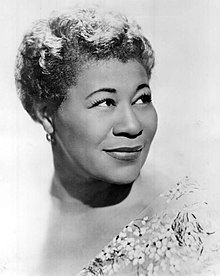
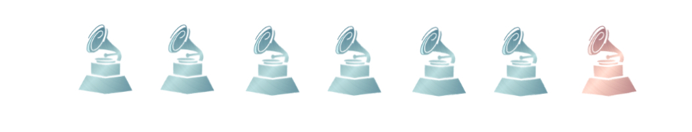
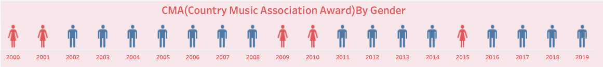
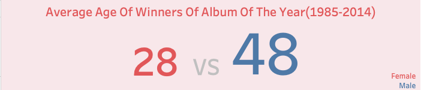

# ***Wireframes and storyboards✍🏻***
Topic: women singers' representation in Grammy Musical Award and the whole music industry in US over the years.  
For the past decades of years, women singers have less chance and representation in Grammy.Fortunately, the situation is getting better recently with a noticeable growth in 2019. However, the gender discrimination still exists in the whole music industry. We need everyone's help to improve the situation.  
## **Part 1: Look Into The Grammy History**        
💡Story 1:  
**First woman wining Grammy in 1959: Ella fitzgerald**

 

     
[Picture Source: wikipedia](https://en.wikipedia.org/wiki/Ella_Fitzgerald#/media/File:Ella_Fitzgerald_1962.JPG).   
Dubbed “The First Lady of Song,” **Ella Fitzgerald** was the most popular female jazz singer in the United States for more than half a century. In 1959, she became the first women who won Grammy in history. In her lifetime, she won 13 Grammy awards and sold over 40 million albums.  
   
       
   
💡Story 2:   
**Gender Distribution Of Nominees In The 1st Grammy In 1959**   

     
 

       
[Data Source: Grammy Awards 1959(May)](awardsandshows.com/features/grammy-awards-1959-may-238.html)   
During the 1st Grammy, there were in total 109 nominees for 26 awards, out of which only 17 are womens.  
This means: for every **6 male nominees**, there is only **1 female nominee**.     
   
       
   
## **Part 2: Look Into Grammy Nowadays**          
💡Story 1:    
Original Chart:       
**Growth Rate of Women Nominees’ Representation (2013 - 2021)**     

<noscript></noscript><object class='tableauViz'  style='display:none;'><param name='host_url' value='https%3A%2F%2Fpublic.tableau.com%2F' /> <param name='embed_code_version' value='3' /> <param name='site_root' value='' /><param name='name' value='GrowthRateofWomenGrammyNomineesRepresentation&#47;Sheet1' /><param name='tabs' value='no' /><param name='toolbar' value='yes' /><param name='static_image' value='https:&#47;&#47;public.tableau.com&#47;static&#47;images&#47;Gr&#47;GrowthRateofWomenGrammyNomineesRepresentation&#47;Sheet1&#47;1.png' /> <param name='animate_transition' value='yes' /><param name='display_static_image' value='yes' /><param name='display_spinner' value='yes' /><param name='display_overlay' value='yes' /><param name='display_count' value='yes' /><param name='language' value='en-US' /><param name='filter' value='publish=yes' /></object>
                
   
[Data Source: Share of Grammy nominations in the United States from 2013 to 2021, by gender](https://www.statista.com/statistics/801372/gender-grammy-nominees/)   
In recent years, the women nominees representation fluctuate a lot with an increasing trend.
 
Chart after changes:            

<noscript></noscript><object class='tableauViz'  style='display:none;'><param name='host_url' value='https%3A%2F%2Fpublic.tableau.com%2F' /> <param name='embed_code_version' value='3' /> <param name='site_root' value='' /><param name='name' value='WomenGrammiesNomineesRepresentationgrowsoverrecentyears&#47;Dashboard1' /><param name='tabs' value='no' /><param name='toolbar' value='yes' /><param name='static_image' value='https:&#47;&#47;public.tableau.com&#47;static&#47;images&#47;Wo&#47;WomenGrammiesNomineesRepresentationgrowsoverrecentyears&#47;Dashboard1&#47;1.png' /> <param name='animate_transition' value='yes' /><param name='display_static_image' value='yes' /><param name='display_spinner' value='yes' /><param name='display_overlay' value='yes' /><param name='display_count' value='yes' /><param name='language' value='en-US' /><param name='filter' value='publish=yes' /></object>
                
       
      
  
      
💡Story 2:  
**Women Representation Percent Comparison 1959 vs Recent 9 years in Grammy**   
Original Chart:       

 

     
[Data Source1: Share of Grammy nominations in the United States from 2013 to 2021, by gender](https://www.statista.com/statistics/801372/gender-grammy-nominees/)  
[Data Source2: Grammy Awards 1959(May)](awardsandshows.com/features/grammy-awards-1959-may-238.html)   
After 50 years, women nominees' representation barely changed.   
       
Chart after changes:       

<noscript></noscript><object class='tableauViz'  style='display:none;'><param name='host_url' value='https%3A%2F%2Fpublic.tableau.com%2F' /> <param name='embed_code_version' value='3' /> <param name='site_root' value='' /><param name='name' value='WomenNomineesRepresentationBarelyChangedAfter50years&#47;Dashboard1' /><param name='tabs' value='no' /><param name='toolbar' value='yes' /><param name='static_image' value='https:&#47;&#47;public.tableau.com&#47;static&#47;images&#47;Wo&#47;WomenNomineesRepresentationBarelyChangedAfter50years&#47;Dashboard1&#47;1.png' /> <param name='animate_transition' value='yes' /><param name='display_static_image' value='yes' /><param name='display_spinner' value='yes' /><param name='display_overlay' value='yes' /><param name='display_count' value='yes' /><param name='language' value='en-US' /><param name='filter' value='publish=yes' /></object>
                

[Data Source1: Share of Grammy nominations in the United States from 2013 to 2021, by gender](https://www.statista.com/statistics/801372/gender-grammy-nominees/)  
[Data Source2: Grammy Awards 1959(May)](awardsandshows.com/features/grammy-awards-1959-may-238.html)   
After 50 years, women nominees' representation barely changed.   
      
  
      
## **Part 3: Look at other music awards & whole music industry in US**
💡Story 1:  
**CMA(Country Music Association Award) Winners By Gender (2000 - 2019)**     

 

           
  [Data Source: Gender Representation of CMA Awards: A Study of Nominees and Winners, 2000-2019](https://songdata.ca/wp-content/uploads/2019/11/SongData_Watson-CMA-NominationHistoryNovember2019.pdf)   
  Out of 20 CMA winners from 2000 to 2019, only 5 winners are women.   
         
         
       
💡Story 2:
  **Women Representation Of 900 Popular Songs(2012-2020) in the US Music Industry**   
  
<noscript></noscript><object class='tableauViz'  style='display:none;'><param name='host_url' value='https%3A%2F%2Fpublic.tableau.com%2F' /> <param name='embed_code_version' value='3' /> <param name='site_root' value='' /><param name='name' value='WomenRepresentationOf900PopularSongs2012-2020&#47;Dashboard1' /><param name='tabs' value='no' /><param name='toolbar' value='yes' /><param name='static_image' value='https:&#47;&#47;public.tableau.com&#47;static&#47;images&#47;Wo&#47;WomenRepresentationOf900PopularSongs2012-2020&#47;Dashboard1&#47;1.png' /> <param name='animate_transition' value='yes' /><param name='display_static_image' value='yes' /><param name='display_spinner' value='yes' /><param name='display_overlay' value='yes' /><param name='display_count' value='yes' /><param name='language' value='en-US' /><param name='filter' value='publish=yes' /></object>
                
    
  [Data Source:Gender Inequality in the Music Industry (2022) – Statistics and Thoughts](https://www.musicianwave.com/gender-inequality-in-the-music-industry-statistics/)       
  Gender discrimination is not limited to Grammy, but also the whole music industry.    
        
        
       
## **Part 4: Dig into the reasons of women's low representation**   
💡Story 1:
**Sexual Harassment in Music Industry Scared Talents Away(2019)**   

<noscript></noscript><object class='tableauViz'  style='display:none;'><param name='host_url' value='https%3A%2F%2Fpublic.tableau.com%2F' /> <param name='embed_code_version' value='3' /> <param name='site_root' value='' /><param name='name' value='SexualHarassment_16646768859060&#47;Dashboard1' /><param name='tabs' value='no' /><param name='toolbar' value='yes' /><param name='static_image' value='https:&#47;&#47;public.tableau.com&#47;static&#47;images&#47;Se&#47;SexualHarassment_16646768859060&#47;Dashboard1&#47;1.png' /> <param name='animate_transition' value='yes' /><param name='display_static_image' value='yes' /><param name='display_spinner' value='yes' /><param name='display_overlay' value='yes' /><param name='display_count' value='yes' /><param name='language' value='en-US' /><param name='filter' value='publish=yes' /></object>
                
          
  [Data Source:Report on Sexual Harassment in Music Industry;](https://musiciansunion.org.uk/legal-money/workplace-rights-and-legislation/the-equality-act-and-guidance/sexual-harassment-at-work/report-on-sexual-harassment-in-music-industry)   
  Sexual harassment is highly prevalent in the music industry and **severely underreported**. Women who want to pursue a career in this industry dare not enter it because the prevalent issues here and some talented women artists just left this industry because of the harassment issues.    
        
            
       
💡Story 2:
**Ageism: Music industry has much stronger preference on young women then young men**

 

               
[Data Source:Here’s the Last 30 Album of the Year Grammy Winners By Age](https://www.billboard.com/music/music-news/grammy-age-album-year-winners-graphic-6465426/)    
The music industry tend to have higher requirement on female artists age. Music companies prefer artists who are young. This can also be proved by the average age comparison here: the average age of male winners of Album of the Year in Grammy from 1985 to 2014 is 48 while that of women winners is 28.  
       
       
       
💡Story 3:
**Male-dominated jury: The Grammy Jury Association: Recording Academy is dominated by male members**

<noscript></noscript><object class='tableauViz'  style='display:none;'><param name='host_url' value='https%3A%2F%2Fpublic.tableau.com%2F' /> <param name='embed_code_version' value='3' /> <param name='site_root' value='' /><param name='name' value='GenderDistributionOfMembersInRecordingAcademy2019&#47;Dashboard1' /><param name='tabs' value='no' /><param name='toolbar' value='yes' /><param name='static_image' value='https:&#47;&#47;public.tableau.com&#47;static&#47;images&#47;Ge&#47;GenderDistributionOfMembersInRecordingAcademy2019&#47;Dashboard1&#47;1.png' /> <param name='animate_transition' value='yes' /><param name='display_static_image' value='yes' /><param name='display_spinner' value='yes' /><param name='display_overlay' value='yes' /><param name='display_count' value='yes' /><param name='language' value='en-US' /><param name='filter' value='publish=yes' /></object>
                
        
[Data Source:Recording Academy Welcomes “Nearly 2000 Diverse”New Members](https://www.billboard.com/music/music-news/recording-academy-welcomes-nearly-2000-new-members-1235136676/)        
  Among the Recording Academy members who are the jury of Grammy Music Awards, in 2019, only 31% of members are female.  
        
             
       
## **Part 5: Learn about the importance of Grammies**      
 💡story 1:      
 **Why Grammies are so important to artists?**
 
<noscript></noscript><object class='tableauViz'  style='display:none;'><param name='host_url' value='https%3A%2F%2Fpublic.tableau.com%2F' /> <param name='embed_code_version' value='3' /> <param name='site_root' value='' /><param name='name' value='SalesUpOfSongsAlbumsAfterGrammyin2020&#47;Dashboard1' /><param name='tabs' value='no' /><param name='toolbar' value='yes' /><param name='static_image' value='https:&#47;&#47;public.tableau.com&#47;static&#47;images&#47;Sa&#47;SalesUpOfSongsAlbumsAfterGrammyin2020&#47;Dashboard1&#47;1.png' /> <param name='animate_transition' value='yes' /><param name='display_static_image' value='yes' /><param name='display_spinner' value='yes' /><param name='display_overlay' value='yes' /><param name='display_count' value='yes' /><param name='language' value='en-US' /><param name='filter' value='publish=yes' /></object>
                
    
Grammy awards drive the sales of songs and are one of the best ways to advertise artists’ songs.
What happens to females artists is that they are overwhelmed in a **vicious circle**:   
1.They do not have money to advertize their songs.    
2.Their songs cannot be heard and noticed.     
3.Less or even no popuarity makes it hard to gain Grammys.      
4.No opportunities to reveal his song at the Grammys.      
5.Grammys are always gained by famous artists: success attracts success, while failure induces failure.  
More women songs deserve hearing and noticing through Grammys.  
      
      
       
## **Part 6: Let's do something to help women artists!**   
 💡Call to action   
**1.	Get involved with organizations that support women in audio:**  
Organizations like [SoundGirls](https://soundgirls.org/), [Women’s Audio Mission](https://womensaudiomission.org/), [We Are Moving the Needle](https://www.wearemovingtheneedle.org/) and [Femme House](https://www.thisisfemmehouse.com/) encourage and support women to pursue a career in music
industry. 

**💰 Donate a few dollars** to these organizations can help a lot of women artists approach their dreams.

**2.	Listen to women-created and women-focused music podcasts:**   
Some splendid women focused music podcats like [Women in Sound](https://www.womeninsound.com/), [We Are the Unheard](https://www.peakmusic.uk/podcast); and [The Last Bohemians](https://www.thelastbohemians.co.uk/) keep promoting excellent women artists whose work deserve hearing and hold online talking about experience sharing and advice discussing.  

**🎧 Listen to these podcasts** to hear their songs and learn about their music stories.
  
**3.	Interact on social media:**   
Most women artists have social media account where they share their daily music stories. Interact with artists you like can gain them and their songs more exposure in public. 
  
**🎙 Follow, interact, comment, retweet, share.** Speak up when gender discrimination discussion happen online. Your simple click and voice can make a huge difference.  
   
      
       
# **Moodboard🎨**

     
 

  
[Picture Source: Women Music Pictures From iStock](https://www.istockphoto.com/search/2/image?phrase=women%20music&alloweduse=availableforalluses&excludenudity=true&sort=best&mediatype=photography&utm_source=unsplash&utm_medium=affiliate&utm_campaign=srp_photos_top&utm_content=https%3A%2F%2Funsplash.com%2Fs%2Fphotos%2Fwomen-music&utm_term=women%20music%3A%3A%3A)       
As shown in the color palette, the color which relates the most to women is color like pink, purple. This is also chosen as the design color for most data visualizations above.  
       
      
       
# **User Research and interviews👂🏻**         
**Target Audience**       
The main target audience are **music fans or lovers** who listen to different kinds of music.      
As the call to action of this whole project is to ask for people to participate and move to help female artists and build a music industry where both male and female have aqual opportunities, music fans or lovers or at least people who follow music and artists will be more likely to relate to the content.      
        
        
       
**Approach to identify representative individuals**       
Since I myselft am a big music fan, I also have some friends who are music fans.    
To diversify the interviewees, The individuals chosen have different appetite for music. Some love jazz, some love pop music, some prefer rock and some prefer light music.   
        
Besides, interviewees chosen have an age range including Millennials and Generation Z.        
Two of the interviewees are girls and feminists: one is a PHD student in finance research, the other is a video game UI designer. The other interviewee is a women who is a product manager and is not feminist. Choosing both ones who are feminists and who are not may help see the whole story in different ways.         
      
| Questions  | Product Manager S | UI designer J | PHD student in finance C |       
| --------- | --------- | --------- | --------- | 
| Q1:  Are all the storyboards clear and closely related to the main topic ? | On the whole, yes, but the overall content is not only a description of the proportion of women, but more description and analysis of the status and status of female musicians in the industry. The purpose is to call attention to female musicians. Therefore, the title itself should be more A call to action, stating a point of view. | It is closely related to the theme, but because there is too much content, the way of scrolling through the interface cuts off the connection between parts, making a tab directory, and clicking directly to the corresponding part will make the structure clearer; when making a web page, you must have a start cover page | In terms of content, the connection is strong, but it lacks an overall framework to string together the stories in different parts; for those who don’t know the Grammys, the story is not attractive, and it is better to add a part of the introduction to the Grammy Awards at the top , the logic is more complete |       
| Q2:  Is there anything you find surprising? What works well in charts? | Colors are intuitive, clear at a glance, in line with public perception; the data presented by the selected story dimension is very sharp, and the contrast and difference are large, which makes people feel shocking; most of the charts can relatively intuitively display the stories to be expressed | The selection and presentation of sexual harassment topics and data is shocking and impressive; the age chart and digital dashboard are eye-catching; the perspective and data of the story logic are more attractive | Neat and uniform tones; can quickly understand the story most charts are telling |       
| Q3:  Is there anything you find confusing? What doesn't work well in charts? | Figure 2-1 The selection of the line chart is quite confusing, and it is difficult for users to understand intuitively. It is more intuitive to stack the bar chart** directly with the actual proportion of women; the background color of other charts should be changed, and the current background color looks dirty | The background color is dirty; the size of the chart is not uniform; the key points that you want to express in the chart can be emphasized in some ways; all charts can be headlined to describe the facts, and subtitles to explain the core story point of view; Chart 2-1 appears empty in presentation ;For Figure 1-2, I'm confused if I don't know the logo; Figure 2-2: The meaning of the chart is not clear enough; Figure 3-2 can add emoji to highlight different categories; Figure 4-1: The background and title content are not informative enough | The logical structure of the story is clear, but the content of different storiesboards feels very scattered and needs a unified framework; Figure 2-1 directly using the ratio will be more intuitive, and the current growth rate will take time to understand; if the importance of Grammys is placed In the front, it will help attract readers; some feminist elements can be added to the call to action part, which will be more provocative; adding a ring diagram to the vicious circle part will be more intuitive and easy to understand  |     
| Q4:  Do you think the color parttern design suit the topic well? | The color selection** is relatively easy to understand for the public, fits the female theme, the overall tone is consistent, and has a good visual education for users; the background color of large pink is dirty, and there are too many pink elements, which are not intuitive, and the chart background needs to be left blank to appear clearer  | The background color looks dirty, maybe with a peach-colored background and white words, the overall visual effect will be much cleaner; when designing web pages, you can embed pictures in the background and make the charts in acrylic translucent form | The choice of color tone is in line with the topic of women's feminism; the chart annotation font can be larger and more reader-friendly |        
| Q5:  How engaged do you feel about the whole story? Will you respond to the call to action? | The story as a whole is very provocative. The choice of angles and numbers stimulates empathy and sympathy, but the language of call to action itself is not refined enough, and the sentences are too long to lose the meaning of slogan.  | The story is not provocative enough, the call to action part can be highlighted in the floating box or tab, users can take action without browsing the entire content; the website can play the background music of female singers, and the website finally displays the source of background music  | The content of the story is clearly visible to the status quo of women in the music industry, but the explanation of the reasons is still at a relatively shallow level and has limited persuasive power, which will affect the motivation of the final call to action.  |       
| Q6:  Is there anything you would change or do differently? | Change color background board to white and leave space; I will add some pictures to increase the atmosphere of each big part to enrich the whole story; add a Hall of Fame picture of a female musician who has made outstanding contributions to express that despite the industry situation is not friendly to women , there are still many female musicians who are drawn out, so as to improve the user's browsing mood, so as to better call to action | Figure 1-2, need to add a color block legend and logo name; Figure 2-2: The title can be more informative, the chart can just show the change in the proportion of women, so as to focus more on the core point, and the progress can be presented with a donut chart ; Figure 3-2 Add emoji to highlight different categories; Figure 4-1: Need to explain the research background (800 female music practitioners), the title of Report or Not should be more specific: Report or Not of witness & experience, gradients can be used for different categories Color representation; Figure 4-2: Use word cloud to form age to make the content richer; Figure 5: Smaller spacing between arrows |  I will interview a female musician who has relevant experience, or find an interview with a female musician about the status and status of female music practitioners. It will be more convincing to use her personal story as the entire storyline. |            
        
 
       
**Main Findings & Possible changes**
For story logic and contents:       
1. An overall frame or sturcture is needed. In this draft, it can be a catalog. In the web page, it can be a tab at the very front of each page.     
2. An introduction is needed for engaging audience who are not familiar with Grammy Awards, especially Grammy's logo and importance in music industry.   
3. The call to action part should be again refined into short slogans to be more provocative.     
4. Current reasoning part is not persuasive enough since the data shown here may not directly prove the reasons stated.     

For charts:        
5. The background color seems dirty and makes the chart not intuitive enough.         
6. Most titles of charts are simply descriptive and not intuitive enough. Can add subtite to strengthen the story telling point.       
7. Chart 1-2: for people who are not familiar with Grammy logo, chart can be confusing.       
8. Chart 2-1: the growth rate itself is not intuitive. Directly showing the representation ratio will be better.           
9. Chart 2-2: can try donut chart to better show the idea of the chart.       
10. Chart 4-1: gradient colors can be used to differentiate between different categories.      
11. Chart 4-2: word cloud of winners' names can be used to form the age shape and make the chart richer.      
12. Chart 5  : the space between each arrow is too big.       
       
**Changes Made & Planned**     

     
 

     
As shown in the priority of changes chart, the change inthe first quadrant with high value and high feasibility was performed in this job already.     
For change 2 and 7: : since the main audience of this project is music lovers, most of them know the importance of Grammy and the logo of Grammy. Thus, no introduction of Grammy at the very front should be fine.        
For change 10,11,12: even though they are of high value to users, it takes time to fix it. Thus, these changes will be included in the next week's work and finally on shorthand display.       
         
For change 4: it's not easy to get direct data related to the reasons of women musicians' low representation. Also, since the other two interviewees can get the chart stories of reasons part relatively intuitively, this change will not be implemented in short term.       
        
 
             
# **Use of Data📊**
Data Sources List:
1. [Picture Source: wikipedia](https://en.wikipedia.org/wiki/Ella_Fitzgerald#/media/File:Ella_Fitzgerald_1962.JPG)   
2. [Data Source: Grammy Awards 1959(May)](awardsandshows.com/features/grammy-awards-1959-may-238.html)    
3. [Data Source: Share of Grammy nominations in the United States from 2013 to 2021, by gender, Statista](https://www.statista.com/statistics/801372/gender-grammy-nominees/)       
4. [Data Source: Gender Representation of CMA Awards: A Study of Nominees and Winners, 2000-2019; JADA E. WATSON](https://songdata.ca/wp-content/uploads/2019/11/SongData_Watson-CMA-NominationHistoryNovember2019.pdf)    
5. [Data Source:Gender Inequality in the Music Industry (2022) – Statistics and Thoughts;Milan Trajkovikj;February 11, 2022](https://www.musicianwave.com/gender-inequality-in-the-music-industry-statistics/)   
6. [Data Source:Report on Sexual Harassment in Music Industry;Musicians' union; 25 March 2022](https://musiciansunion.org.uk/legal-money/workplace-rights-and-legislation/the-equality-act-and-guidance/sexual-harassment-at-work/report-on-sexual-harassment-in-music-industry)      
7. [Data Source:Here’s the Last 30 Album of the Year Grammy Winners By Age; Joe Lynch; 06 Feb. 2015](https://www.billboard.com/music/music-news/grammy-age-album-year-winners-graphic-6465426/)   
8. [Data Source:Recording Academy Welcomes “Nearly 2000 Diverse”New Members; Paul Grein; 9 September 2022](https://www.billboard.com/music/music-news/recording-academy-welcomes-nearly-2000-new-members-1235136676/)    
9. [Data Source: Growth of music sales on the day after the Grammy Awards in 2020, by type; Statista](https://www.statista.com/statistics/252744/growth-of-music-sales-following-the-grammay-awards/)    
10. [Idea Source: These Are 3 Of The Biggest Drivers Of Gender Inequality In Music; Andrea Bossi; Mar 26, 2021](https://www.forbes.com/sites/andreabossi/2021/03/26/these-are-3-of-the-biggest-reported-drivers-of-gender-inequality-in-music/) 
11. [Idea Source: 10 Ways To Support Women Musicians & Creators Year-Round; LILY MOAYERI; MAR 2, 2022](https://www.grammy.com/news/10-ways-to-support-women-in-music-year-round)   
12. [Picture Source: Women Music Pictures From iStock](https://www.istockphoto.com/search/2/image?phrase=women%20music&alloweduse=availableforalluses&excludenudity=true&sort=best&mediatype=photography&utm_source=unsplash&utm_medium=affiliate&utm_campaign=srp_photos_top&utm_content=https%3A%2F%2Funsplash.com%2Fs%2Fphotos%2Fwomen-music&utm_term=women%20music%3A%3A%3A)
  
  

  
