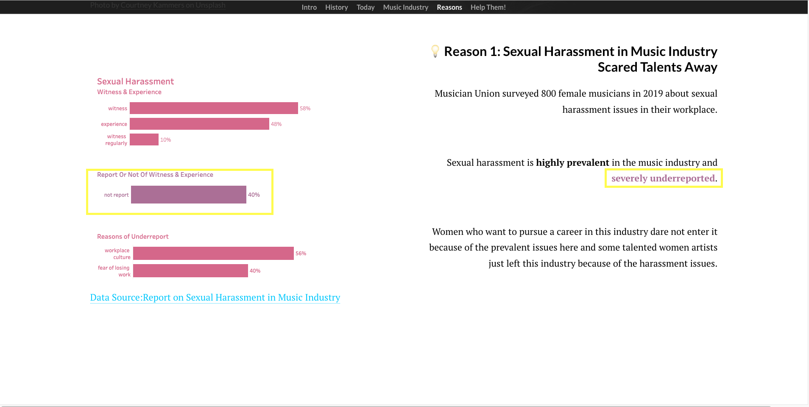
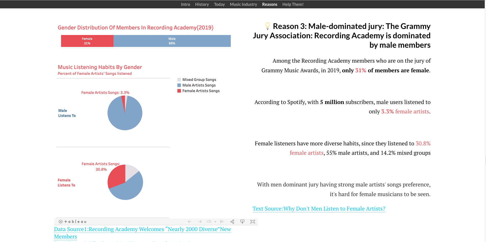
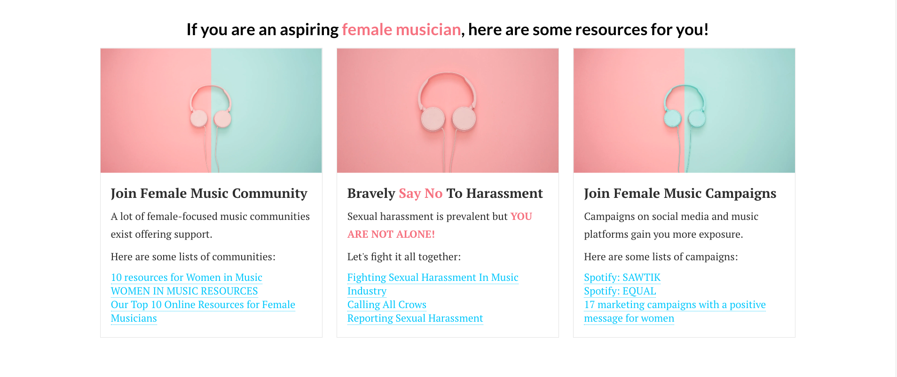

# Catalog of final project      
Part I  : [Brief Intro & Pitch to the topic: Female Representation In Grammies](https://caro996.github.io/Telling-stories-with-data/final_project_CarolineZHU.html)       
Part II : [Storyline Draft & User Research](https://caro996.github.io/Telling-stories-with-data/final_project_CarolineZHU1.html)        
Part III: [Final Wrap Up](https://caro996.github.io/Telling-stories-with-data/final_project_CarolineZHU2.html)   
Final website: [Shorthand Display](https://carnegiemellon.shorthandstories.com/female-musicians-by-Caroline-ZHU/index.html)       
Final pre pitch: [Shorthand Display](https://carnegiemellon.shorthandstories.com/female-musicians-Predemo-Caroline-ZHU/index.html)       

# Brief Summary So Far✍🏻       
**Part I**       
In part I, I designed the story arc/emotions of arc. Put together the thoughts I have for this topic with some sketches corresponding to each scenario.   
Three simple call to actions are drafted and main medium to be used for final display is also identified.       
Several peer feedbacks during t he class help to give me more clues on how to present my stories more clearly.      
**Part II**       
In part II, I further designed the whole story line and contents in detail with all sketches turned into digital charts with help of Tableau.       
Moodboard is used to identify the main color frame or theme of the website and also the color chosen for most data visualizations.       
For doing an effective user research, main targeted audience is identified. When picking up sample respondents to do the research, diversity of groups is emphasized to get various feedbacks towards the data visualization stories.         
Questions asked cover not just the data visualization design, but also the logic of whole story line and the engagement respondents feel to finally react to the call to action.       
After getting a bunch of feedbacks, I note down main possible changes and use priority of changes chart to organize and decide which changes to implement and focus. Some highly feasible and valuable changes are made directly.       
**Part III**       
In part III, based on all previous feedbacks including ones from professor Christopher Goranson, I finally implement everything into the shorthand website. 
Changes made include mainly 3 parts:       
1. Data visualization adjustments after taking into consideration of the shorthand display limits and possibilities.       
2. Storyline organization adjustments to better catch reader's attention.       
3. A framework to link or join all the story points together.        
4. New data, research and resources included to make the story logic more reasonable and easier to follow.       

# Final Data Story🎬       
Changes made since completion of part II:       
1. Direct call to action is added in the cover page as subtitle to inform this idea since the beginning of the page view. In this case, even if readers are not patient to read the whole story line to the end, they can still have a sense of what I'm trying to call to action.        
       

 

      
        
2. An introduction of Grammy is added at the beginning of the storyline. In this case, for audience who may not know Grammy well, they can have the chance to learn about it directly in this website before going forward to later story points.      
       

 

      
       
3. Grammies' importance is moved from the near end of whole story line to the front. This can act as a hook to draw audience attention and also stress on the issues women musicians face at first.       
       

 

     
       
4. For women in Grammies history part, both charts of 17:109 Grammy trophies and 1:6 Grammy trophies are kept to emphasize on the gender discrimination issues since the beginning of Grammies.      
      

 

      
       

 

         
       
5. CMA winners data visualization is truncated from 20 years long view into 2 views of 10 years. Due to the limitation of shorthand, the picture's size cannot be manipulated easily. Cut the original chart into 2 lines will make everything in the chart clearer and bigger, thus more reader friendly.    
       

 

       
        
6. Menu bar including each big important part title is added on the top of the website. For readers who want to jump back and forth, it can be done easily with this bar.      
       

 

             
       
7. A lot of questions and titles like "Why is women musicians' representation so low?" "Does the industry have similar situations?" "Women in Grammies History" "Women in Grammies Today" are added on top of each corresponding part to make the story line more jointed and clearer.     
         

 

        

 

        
       
8. Some parts of explaination texts are highlighted with corresponding color in the data visualization charts aside to again catch attention.      
          

 

        
       
10. The main color theme corresponds to the color moodboard used before in Part II. However, due to the copy right concerns and the story telling needs, for some parts like Reasons of women's low representation, picture with black and white color is used to again render a sad emotion. When it comes to calling to action, bright colors are used to lift up the emotions.       
       

 

        
       
11. For reason 3: Male dominated jury, further information and charts are added to complete the logic/comprehension gap. Data from Spotify about music listener's listenting preference by gender is used. It's abvious that male listeners listen to so few female artists songs while they are taking 70% positions in jury association of Grammy. This further explains women's low representation then(I hope so).       
       

 

       
       
12. Resources for aspiring musicians are also added after the calling to action. The main audience for this story is still music fans, but to adress the main issue here, relying only on music fans is far from enough. Female musicians themselves should also have access to helpful resources and act actively for the change of women's "equal" representation in music industry to happen.         
          

 

       
       
       
**For identifying the audience**:   
Since the main purpose in the end is to help promote female artists, the audience that are highly likely to respond to call to action are music fans.       
But at the same time, to really change the industry gender discrimination situation, only fans support will not be enough. Thus, another audience of this project will be female musicians. Some female musician support resources are offered in the end to let them know they are not alone and there are organizations and communities there to help.        
       
As I reflect on the process I went through to reach this point, I believe the user research and peer feedback helped most. Sometimes, after doing a lot of researches, we may be over confident about our story including the story telling points and the internal story logic that links the whole stories together. Showing the work to all different students, friends and professor with various backgrounds can help a lot to make the final display clearer and more friendly. For example, as a music fan for many years, I did not notice someone might know nothing about Grammies and an introduction to Grammy is actually needed at the very beginning of the story.       
       
       
**Final Presentation Pitch**:  
[Shorthand Display](https://carnegiemellon.shorthandstories.com/female-musicians-Predemo-Caroline-ZHU/index.html)       
**Final website**: 
[Shorthand Display](https://carnegiemellon.shorthandstories.com/female-musicians-by-Caroline-ZHU/index.html)
       
       
# **Use of Data📊**
Data Sources List:
1. [Picture Source: wikipedia](https://en.wikipedia.org/wiki/Ella_Fitzgerald#/media/File:Ella_Fitzgerald_1962.JPG)   
2. [Data Source: Grammy Awards 1959(May)](awardsandshows.com/features/grammy-awards-1959-may-238.html)    
3. [Data Source: Share of Grammy nominations in the United States from 2013 to 2021, by gender, Statista](https://www.statista.com/statistics/801372/gender-grammy-nominees/)       
4. [Data Source: Gender Representation of CMA Awards: A Study of Nominees and Winners, 2000-2019; JADA E. WATSON](https://songdata.ca/wp-content/uploads/2019/11/SongData_Watson-CMA-NominationHistoryNovember2019.pdf)    
5. [Data Source:Gender Inequality in the Music Industry (2022) – Statistics and Thoughts;Milan Trajkovikj;February 11, 2022](https://www.musicianwave.com/gender-inequality-in-the-music-industry-statistics/)   
6. [Data Source:Report on Sexual Harassment in Music Industry;Musicians' union; 25 March 2022](https://musiciansunion.org.uk/legal-money/workplace-rights-and-legislation/the-equality-act-and-guidance/sexual-harassment-at-work/report-on-sexual-harassment-in-music-industry)      
7. [Data Source:Here’s the Last 30 Album of the Year Grammy Winners By Age; Joe Lynch; 06 Feb. 2015](https://www.billboard.com/music/music-news/grammy-age-album-year-winners-graphic-6465426/)   
8. [Data Source:Recording Academy Welcomes “Nearly 2000 Diverse”New Members; Paul Grein; 9 September 2022](https://www.billboard.com/music/music-news/recording-academy-welcomes-nearly-2000-new-members-1235136676/)    
9. [Data Source: Growth of music sales on the day after the Grammy Awards in 2020, by type; Statista](https://www.statista.com/statistics/252744/growth-of-music-sales-following-the-grammay-awards/)    
10. [Idea Source: These Are 3 Of The Biggest Drivers Of Gender Inequality In Music; Andrea Bossi; Mar 26, 2021](https://www.forbes.com/sites/andreabossi/2021/03/26/these-are-3-of-the-biggest-reported-drivers-of-gender-inequality-in-music/) 
11. [Idea Source: 10 Ways To Support Women Musicians & Creators Year-Round; LILY MOAYERI; MAR 2, 2022](https://www.grammy.com/news/10-ways-to-support-women-in-music-year-round)   
12. [Picture Source: Women Music Pictures From iStock](https://www.istockphoto.com/search/2/image?phrase=women%20music&alloweduse=availableforalluses&excludenudity=true&sort=best&mediatype=photography&utm_source=unsplash&utm_medium=affiliate&utm_campaign=srp_photos_top&utm_content=https%3A%2F%2Funsplash.com%2Fs%2Fphotos%2Fwomen-music&utm_term=women%20music%3A%3A%3A)
13. [Resource for female Musicians: Here For the Music](https://www.callingallcrows.org/hftm)
14. [Resource for female Musicians: End Sexual Harassment At Work](https://musiciansunion.org.uk/campaigns/end-sexual-harassment-at-work)
15. [Resource for femal Musicians:Soundsgirls_Report Sexual Harassment](https://soundgirls.org/reporting-sexual-harassment/)
16. [Picture resource:headphones_pink on Pixabay](https://pixabay.com/photos/headphones-pink-pastel-colors-3435885/)
17. [Picture resource:headphones_pink and green on Pixabay](https://pixabay.com/photos/headphones-blue-pink-pastel-colors-3435888/)
18. [Picture resource:headphones_green on Pixabay](https://pixabay.com/photos/headphones-blue-pink-pastel-colors-3435880/)
19. [Resource for female Musicians: 17 marketing campaigns](https://econsultancy.com/17-marketing-campaigns-with-a-positive-message-for-women/)
20. [Resource for female Musicians: Spotify launch Sawtik](https://campaignme.com/spotify-launches-sawtik-to-celebrate-emerging-arab-female-artists-across-the-mena-region/)
21. [Resource for female Musicians: Spotify launch EQUAL](https://newsroom.spotify.com/2021-03-08/celebrating-international-womens-day-with-our-new-campaign-equal/).      
22. [Top 10 Online Resources For Female Musicians](https://flypaper.soundfly.com/hustle/our-top-ten-online-resources-for-female-musicians/) 
23. [10 Resources For Women In Music](https://www.icmp.ac.uk/blog/10-resources-womxn-music)         
24. [Songtrust Women In Music Resources](https://www.songtrust.com/womens-in-music-resouces)       
       

